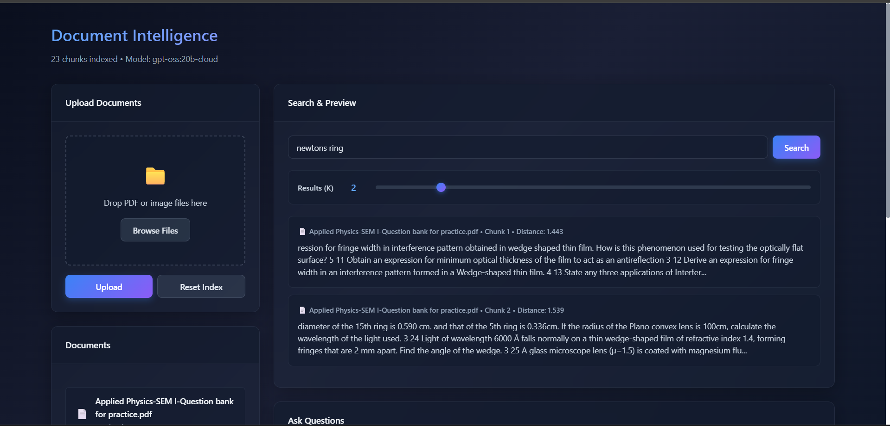
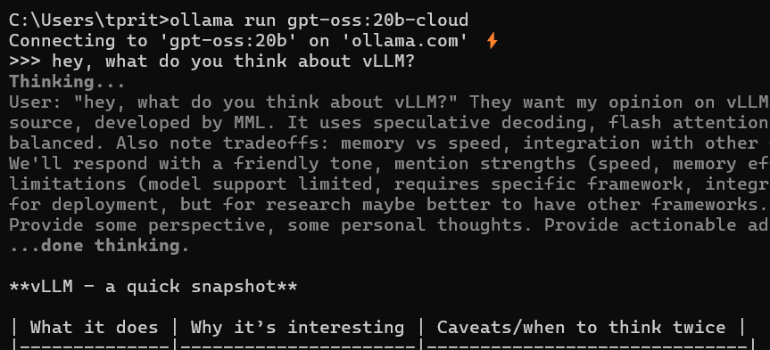
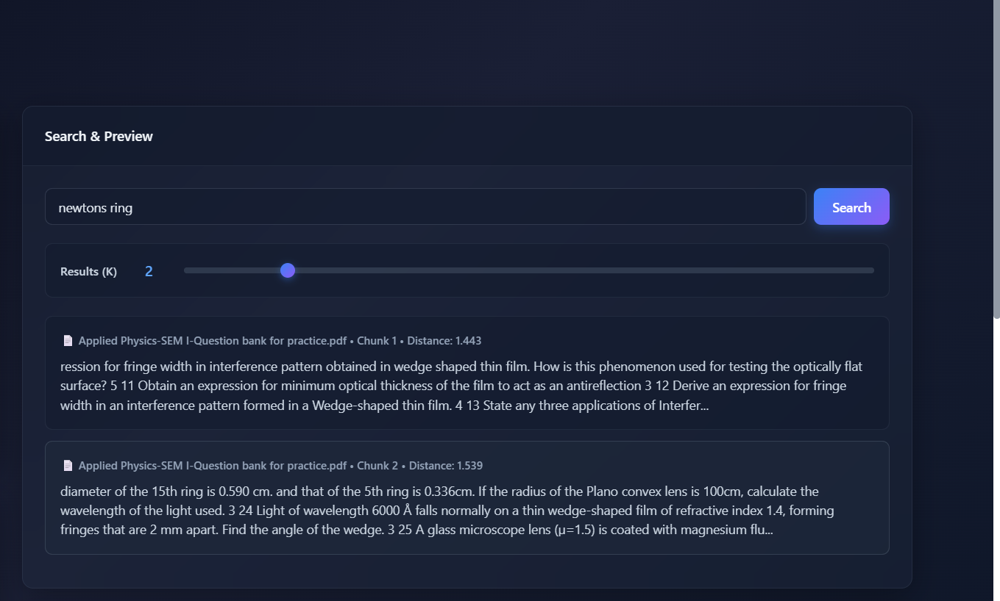
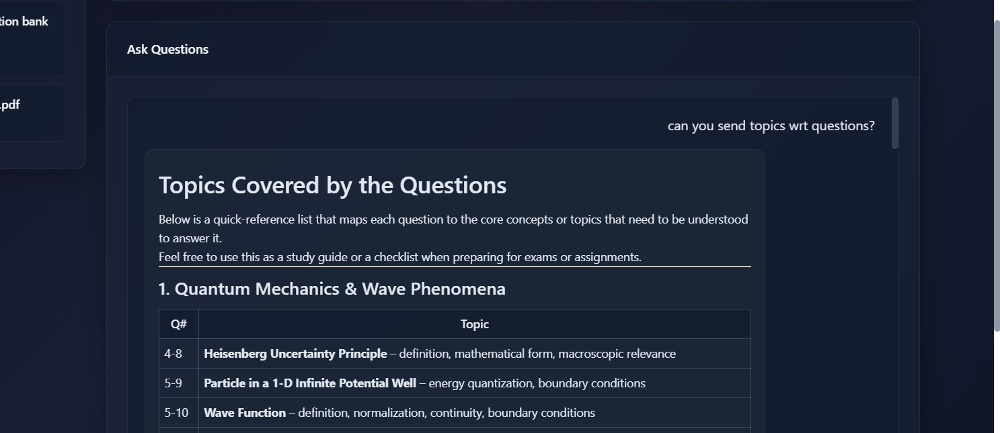

# RAG Pipeline

Retrieval-Augmented Generation system using Chroma DB and Ollama for local document Q&A.


## How It Works

**Setup Phase:**
1. Documents are split into chunks
2. Chunks are converted to embeddings
3. Embeddings stored in Chroma vector database

**Query Phase:**
1. User asks a question
2. Relevant chunks retrieved from Chroma
3. Ollama LLM generates answer using retrieved context

## Tech Stack

- **Vector DB**: ChromaDB
- **LLM**: Ollama (local)
- **Privacy**: Fully offline

## Installation

```bash
pip install -r requirements.txt
ollama pull gpt-oss:20b-cloud
ollama serve
uvicorn app:main --reload
```

- Check live server web

## Demo

### Document Intelligence


### Ollama Setup


### Semantic Search


### Generated Response

